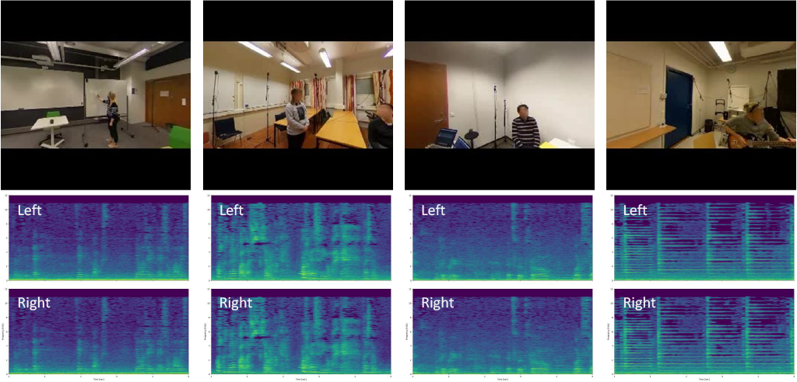
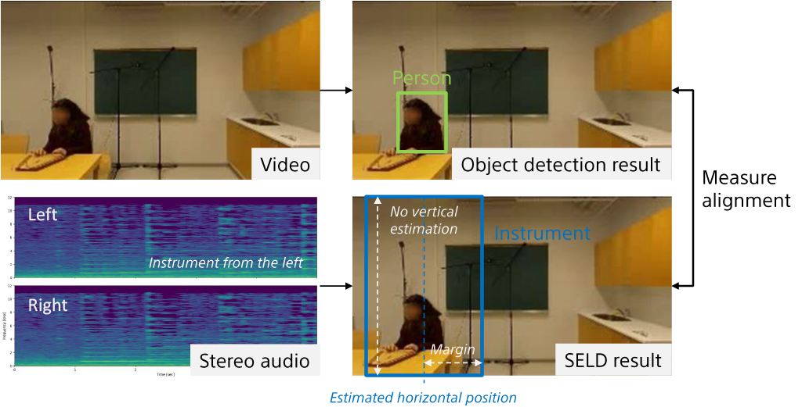

# SAVGBench: Benchmarking Spatially Aligned Audio-Video Generation

This repository includes the brief introduction, dataset link, and source code for "SAVGBench: Benchmarking Spatially Aligned Audio-Video Generation."

## Abstract

This work addresses the lack of multimodal generative models capable of producing high-quality videos with spatially aligned audio.
While recent advancements in generative models have been successful in video generation, they often overlook the spatial alignment between audio and visuals, which is essential for immersive experiences.
To tackle this problem, we establish a new research direction in benchmarking the Spatially Aligned Audio-Video Generation (SAVG) task.
We introduce a spatially aligned audio-visual dataset, whose audio and video data are curated based on whether sound events are onscreen or not.
We also propose a new alignment metric that aims to evaluate the spatial alignment between audio and video.
Then, using the dataset and metric, we benchmark two types of baseline methods: one is based on a joint audio-video generation model, and the other is a two-stage method that combines a video generation model and a video-to-audio generation model.
Our experimental results demonstrate that gaps exist between the baseline methods and the ground truth in terms of video and audio quality, as well as spatial alignment between the two modalities.

Data Examples:


Spatial AV-Align Metric:


## Generated Videos

https://github.com/user-attachments/assets/2038cab3-06f5-47d2-826d-8cf6461d9be3

https://github.com/user-attachments/assets/158d7423-550e-4b0f-bcb6-793a01c22afa

https://github.com/user-attachments/assets/99a10103-6bb4-40ff-b0e3-04437c346ff0

https://github.com/user-attachments/assets/9b96eb99-c0a8-4c4e-9fd8-6e79c0d915de

## SAVGBench Dataset

The SAVGBench dataset can be downloaded from [Zenodo](https://zenodo.org/records/17139882).
We use the development set for training and the evaluation set for evaluation.

https://github.com/user-attachments/assets/edcd51f4-c167-418c-9d4e-e4ed94ba8021

https://github.com/user-attachments/assets/b01a76dc-9eb2-44c1-be91-2382282732d7

## Getting Started - Joint Method / Evaluation Metrics

### Git clone

You can use git clone and move into the directory.
```bash
git clone https://github.com/SonyResearch/SAVGBench.git
cd SAVGBench
```

### Download pretrained models

You can download the pretrained models from [Google Drive](https://drive.google.com/file/d/1_8yjcKEkai_KUR9n4KtduPew0yXxOWlI/view?usp=sharing).
```bash
unzip YOUR_DOWNLOAD_PATH/SAVGBench_PretrainedModels_V1.zip
```

#### Set pretrained models for inference of joint baseline method

You need to move the pt files of the joint baseline method.
```bash
mkdir joint_method/pretrained_models
mv YOUR_DOWNLOAD_PATH/SAVGBench_PretrainedModels_V1/model330011.pt joint_method/pretrained_models/
mv YOUR_DOWNLOAD_PATH/SAVGBench_PretrainedModels_V1/model_SR_mmdiff_120000.pt joint_method/pretrained_models/
```

#### Set pretrained models for Spatial AV-Align metric

You need to move the pth files of the object detection and sound event localization and detection (SELD) models, which are used in the computation of Spatial AV-Align.
```bash
mv YOUR_DOWNLOAD_PATH/SAVGBench_PretrainedModels_V1/yolox_tiny_8x8_300e_coco_20211124_171234-b4047906.pth av_spatial_evaluation/object_detection_svg_infer/
mkdir -p av_spatial_evaluation/stereo_seld_infer/data/model_monitor/20240912162834/
mv YOUR_DOWNLOAD_PATH/SAVGBench_PretrainedModels_V1/params_swa_20240912162834_0040000.pth av_spatial_evaluation/stereo_seld_infer/data/model_monitor/20240912162834/
```

### Prepare python environment

The inference and metric computation has been tested on python 3.10.19 and torch 2.1.2.
For example, you can use a [miniforge](https://github.com/conda-forge/miniforge) environment.

```bash
conda create --name savgbench python=3.10 -y
conda activate savgbench
# conda install -c conda-forge ffmpeg  # if needed

pip install torch==2.1.2 torchvision==0.16.2 torchaudio==2.1.2 --index-url https://download.pytorch.org/whl/cu121
pip install -r requirements_joint_and_metric.txt

pip install openmim==0.3.9
mim install mmengine==0.10.7 mmcv==2.1.0 mmdet==3.3.0  # mmdetection for object detection: https://mmdetection.readthedocs.io/en/latest/get_started.html
```

### Run evaluation script (including inference and metric computation)

Before running the evaluation script `./evaluation_script.sh`, please modify the paths in the script to use correct paths.

The inference script `./joint_method/run_baseline.sh` is called from the evaluation script.
You may configure batch size and the GPUs to be used from this file.

You can run the evaluation script.
```bash
./evaluation_script.sh VIDEO_OUTPUT_DIR VIDEO_REFERENCE_DIR NUM_GPUS
```

Please use **absolute paths**. For example, to run on 1 GPU:
```bash
./evaluation_script.sh /home/USER_DIR/SAVGBench/result_outputs/ /home/USER_DIR/SAVGBench/SAVGBench_Dataset_Evaluation/video_eval/ 1
```

It takes around 30 minutes to generate 96 samples (default). Then you can check the evaluation results at `./results.out`.
```
AV spatial each component: num_TP: 2382, num_FN: 2320, num_TP + num_FN: 4702
AV_final_score: 0.5065929391748192
{'fvd': 1218.8477783203125, 'kvd': 55.60466751187866, 'fad': 9.357064962387085}
Temporal AV-Align: 0.6680675666494543
```
The results may vary depending on random seeds etc, but you can get similar results to the ones reported.
Please note that the FAD score is better than the paper's value since a bug in the FAD computation was fixed.

### Run training scripts of joint method

See [joint_method/TRAINING_JOINT.md](joint_method/TRAINING_JOINT.md).
